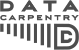
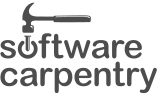
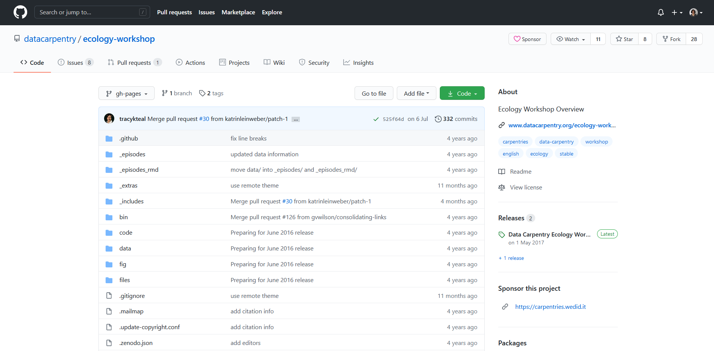
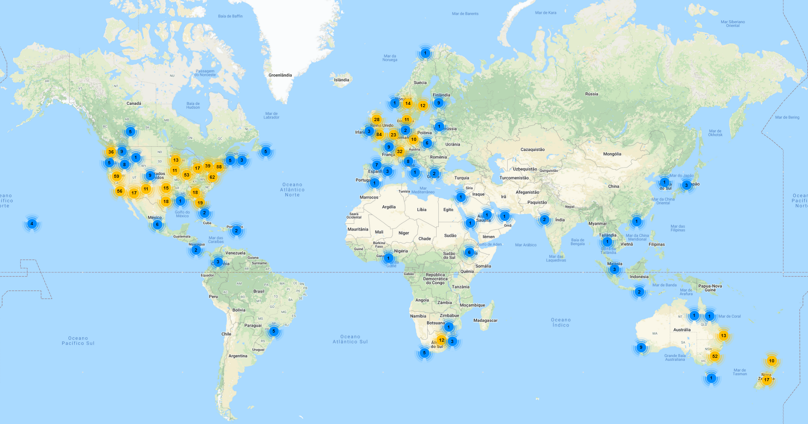
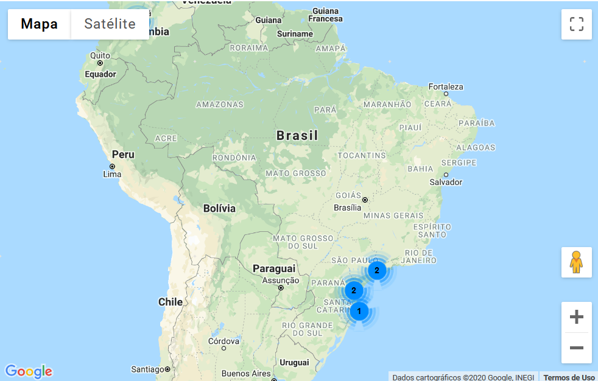
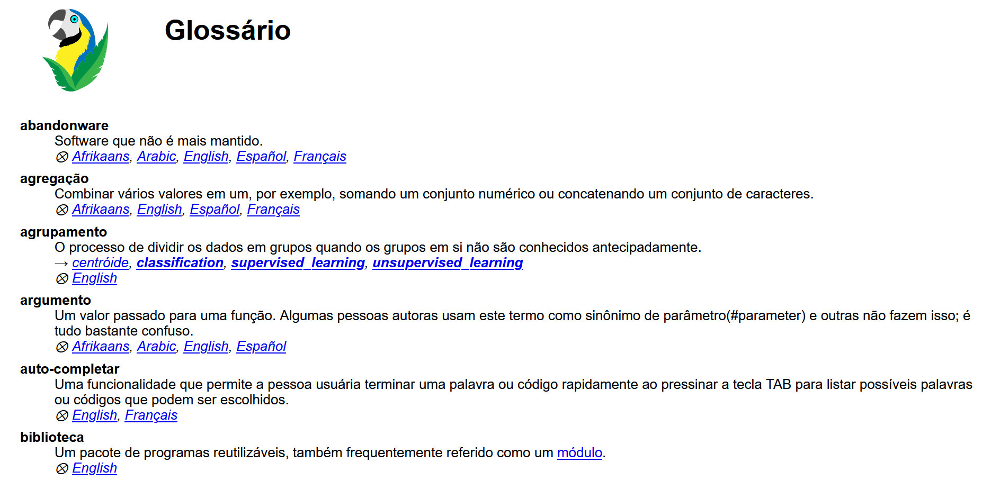
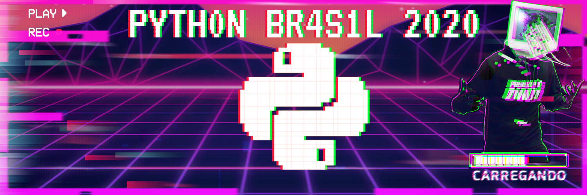

class: middle
```{r, child="header.Rmd"}
```

```{r logo, echo=FALSE}
xaringanExtra::use_logo(
  image_url = "https://raw.githubusercontent.com/carpentries/logo/756b57cb8ae9a469dc92d9f8b9409193a713181d/carpentries-hex-white.svg",
  link_url = "https://carpentries.org/"
)

```


.pull-left[
### Mariana Dias Guilardi (ela/dela)
<!-- inicio icones -->
<a href='mailto:diasgmariana@gmail.com'><i class="far fa-envelope"></i></a>   
<a href='https://twitter.com/mariguilardi'  target="_blank"><i class="fab fa-twitter"></i></a>   
<a href='https://github.com/mariguilardi' target="_blank"><i class="fab fa-github"></i></a>   
<a href='https://orcid.org/0000-0002-6076-0023' target="_blank"><i class="fab fa-orcid"></i></a>   
<a href='https://bit.ly/2QPS4Rr' target="_blank"><i class="ai ai-lattes"></i></a> 
<!-- final icones -->

- Em processo para se tornar instrutora da The Carpentries
- Participante: [PyLadies São Paulo](sympla.com.br/PyLadiesSP), [R-Ladies São Paulo](https://www.meetup.com/R-Ladies-Sao-Paulo/), [Grupo de Estudos em Data Science do PyLadies São Paulo](https://github.com/PyLadiesSP/data-science)
- Co-organizadora: [satRday São Paulo](https://saopaulo2019.satrdays.org/)
- Mestranda no Programa Interunidades em Biotecnologia (USP/IPT/IBu)
- Bacharela em Ciências Biológicas (UFSCar *campus* Sorocaba)
]

.pull-right[
### Beatriz Milz (ela/dela)
<!-- inicio icones -->
<a href='https://beatrizmilz.com'><i class="fas fa-house-user"></i></a>    
<a href='mailto:beatriz.milz@usp.br'><i class="far fa-envelope"></i></a>   
<a href='https://twitter.com/BeaMilz'  target="_blank"><i class="fab fa-twitter"></i></a>   
<a href='https://github.com/beatrizmilz' target="_blank"><i class="fab fa-github"></i></a>   
<a href='https://orcid.org/0000-0002-3064-4486' target="_blank"><i class="fab fa-orcid"></i></a>   
<a href='http://lattes.cnpq.br/5150665880581477' target="_blank"><i class="ai ai-lattes"></i></a>   
<a href='https://beatrizmilz.github.io/resume/index.html' target="_blank"><i class="ai ai-cv"></i></a>   
<a href='https://discourse.curso-r.com/u/beatrizmilz/summary' target="_blank"><i class="fab fa-discourse"></i></a> 
<a href='https://www.instagram.com/beatrizmilz/' target="_blank"><i class="fab fa-instagram"></i></a> 
<!-- final icones -->

- [Instrutora da The Carpentries](https://carpentries.org/instructors/)
- [Instrutora de `tidyverse` certificada pela RStudio](https://education.rstudio.com/trainers/people/milz+beatriz/)
- Co-organizadora: [R-Ladies São Paulo](https://www.meetup.com/R-Ladies-Sao-Paulo/), [satRday São Paulo](https://saopaulo2019.satrdays.org/), [LatinR](https://latin-r.com/pt), [useR! 2021 global](https://user2021.r-project.org/)
- [Doutoranda em Ciência Ambiental (IEE/USP)](https://beatrizmilz.github.io/tese/)
- Mestre em Ciências (UNIFESP)
- Bacharela em Gestão Ambiental (EACH/USP)
- [Embaixadora de Inovação Cívica da Open Knowledge Brasil](https://embaixadoras.ok.org.br/).
]

---
class: middle

## Quem somos nós?

- Pesquisadoras

- Programadoras

- Participantes de comunidades de programação

<!-- pensei em colocar ilustrações aqui --> 

<!-- m: ADOREI O SLIDE! Vou tentar pensar em ilustrações aqui, mas fique a vontade de por o que achar melhor :) -->


---
class: middle

## Pessoas que contribuiram com esta apresentação:

- Alexandre Villares

- Filipe Fernandes

- Melissa Weber Mendonça

- Vinicius Salazar


---
class:  middle

## O que é a The Carpentries?

- Visão: ser a comunidade inclusiva líder em ensino de dados e habilidades de programação.

- Missão: desenvolver capacidade global em habilidades essenciais de computação e de dados para conduzir pesquisas eficientes, abertas e reproduzíveis. 

Fonte: https://carpentries.org/about/

---
class: middle

## Código de conduta


1. Usar linguagem acolhedora e inclusiva.  

1. Ser uma pessoa respeitosa em relação a diferentes pontos de vista e experiências.

1. Focar no que é o melhor para a comunidade.

1. Mostrar cortesia e respeitar as outras pessoas que fazem parte da comunidade.

- Leia o [Código de conduta](https://docs.carpentries.org/topic_folders/policies/code-of-conduct.html) completo!


---
class:  middle

## O que é a The Carpentries?

- O projeto Carpentries compreende as comunidades: [Data Carpentry](http://www.datacarpentry.org/), [Library Carpentry](https://librarycarpentry.org/), [Software Carpentry](https://software-carpentry.org/), pessoas treinadoras, mantenedoras, ajudantes e apoiadoras que compartilham a missão de ensinar habilidades básicas de computação e ciência de dados para pesquisadores.

- O foco está em pessoas conduzindo e apoiando pesquisas. 

---
class:  middle

## [Data Carpentry](http://www.datacarpentry.org/)

.pull-left[
- Desenvolve e ministra oficinas sobre as habilidades de dados fundamentais necessárias para conduzir pesquisas, cobrindo todo o ciclo de vida da pesquisa baseada em dados.

<br>
```{r echo=FALSE, out.width="50%", fig.align='center', fig.cap="Legenda: Logo da Data Carpentry"}

```

]

.pull-right[

- Lições:

  - [Data Analysis and Visualization in Python for Ecologists](https://datacarpentry.org/python-ecology-lesson/)

  - [Data Analysis and Visualization with Python for Social Scientists](Data Analysis and Visualization with Python for Social Scientists *alpha*)
  
  - [Image Processing with Python](https://datacarpentry.org/image-processing/)
  
  - Material da comunidade: [Python for Atmosphere and Ocean Scientists](https://carpentrieslab.github.io/python-aos-lesson/)

]

---
class:  middle

## [Library Carpentry](https://librarycarpentry.org/)

.pull-left[
- Concentra-se na construção de habilidades de *software* e dados em comunidades relacionadas a bibliotecas e informações.

<br>
```{r echo=FALSE, out.width="50%", fig.align='center', fig.cap="Legenda: Logo da Library Carpentry"}

```

 

]

.pull-right[

- Lições:

  - [Introduction to Python](https://librarycarpentry.org/lc-python-intro/)

]

---
class:  middle

## [Software Carpentry](https://software-carpentry.org/)

.pull-left[

- Ensina aos pesquisadores as habilidades de computação de que precisam para fazer mais em menos tempo e de forma menos dolorosa.

<br>
```{r echo=FALSE, out.width="50%", fig.align='center', fig.cap="Legenda: Logo da Software Carpentry"}

```

]

.pull-right[


- Lições:

  - [Programming with Python](http://swcarpentry.github.io/python-novice-inflammation)

  - [Plotting and Programming in Python](http://swcarpentry.github.io/python-novice-gapminder)

]

---
class:  middle

## Como este trabalho é feito?

- Treinamento e fomento de uma comunidade **ativa**, **inclusiva** e **diversa** de pessoas alunas e instrutoras. 

- Desenvolvimento de lições disponíveis de forma colaborativa.

- Aplicação das lições com práticas de ensino baseadas em evidências.

---
class:  middle

## Como este trabalho é feito? 

### [Oficinas](https://carpentries.org/workshops/#workshop-curriculum) 
  - Data Carpentry: [Ecology](https://datacarpentry.org/lessons/#ecology-workshop), [Genomics](https://datacarpentry.org/lessons/#genomics-workshop), [Geospatial](https://datacarpentry.org/lessons/#geospatial-curriculum) e [Social Sciences](https://datacarpentry.org/lessons/#social-science-curriculum)
  - [Library Carpentry](https://librarycarpentry.org/lessons/): expressões regulares, Unix Shell, controle de versionamento com Git e OpenRefine
  - [Software Carpentry](https://software-carpentry.org/lessons/): Unix Shell, controle de versionamento com Git e Python ou R
  - Community Developed Lessons

---
class:  middle

## Como este trabalho é feito? 

### [Oficinas](https://carpentries.org/workshops/#workshop-curriculum) 

- Contribuições para essas oficinas podem ser feitas no GitHub da [Data Carpentry](https://github.com/datacarpentry), [Library Carpentry](https://github.com/LibraryCarpentry) e [Software Carpentry](https://github.com/swcarpentry).

```{r echo=FALSE, out.width="50%", fig.align='center' , fig.cap="Legenda: Imagem do Repositório no GitHub do material da oficina sobre Ecologia, da Data Carpentry."}

```


---
class:  middle

## Como fazer parte da comunidade?

- Sendo uma pessoa [instrutora](https://carpentries.org/community/#instructors).

- Instrutoras organizam e ensinam oficinas para disseminar a alfabetização em dados e habilidades de programação tanto local quanto globalmente. 

- Instrutoras promovem e modelam a importância do *software* e dos dados na pesquisa.

- As pessoas instrutoras de nossa comunidade trabalham juntas para aumentar ativamente suas habilidades técnicas e de instrução. 

- Tornar-se uma instrutora é um grande passo para aprimorar suas próprias habilidades técnicas e ajuda você a se tornar uma pessoa comunicadora técnica mais eficaz.

---
class:   middle

## Instrutoras - Mundo


```{r echo=FALSE, out.width="60%", fig.align='center',  fig.cap="Legenda: Imagem do mapa do mundo mostrando a localização das pessoas instrutoras da Carpentries.  Na Europa e América do Norte estão a maioria das pessoas instrutoras."}

```

Fonte: https://carpentries.org/instructors-map/

---
class:   middle

## Instrutoras - Brasil

```{r echo=FALSE, out.width="50%", fig.align='center', fig.cap="Legenda: Imagem do mapa do Brasil mostrando a localização das pessoas instrutoras da Carpentries.  No Brasil aparecem 5 pessoas instrutoras no mapa."}

```

Fonte: https://carpentries.org/instructors-map/

---
class:   middle

## [Treinamento de instrutoras](https://carpentries.github.io/instructor-training/)

1. [Pedido para treinamento](https://amy.carpentries.org/forms/request_training/)

2. Receber email com o link para agendar o treinamento.

3. Treinamento online em inglês:  
  - Treinamento de dois dias. 

  - Durante período de quarentena: possibilidade de realizar treinamento quatro dias com 1h30min. 

4. Etapa final de treinamento (*Checkout Process*): 

  4.1 Contribuir com uma oficina, através do GitHub.
 
  4.2 Participar de uma discussão online (*community discussion*).
  
  4.3 Demonstração com código ao vivo (*live coding demo*) de 5 minutos.

---
class: middle

## Desafios para a comunidade no Brasil

- Treinamento de pessoas instrutoras é em inglês.

- Poucas pessoas instrutoras certificadas.

- Material de oficinas está em inglês. 


---
class: middle

### [Glossário](https://glosario.carpentries.org/)

- É um glossário de código aberto (open source) de termos utilizados em ciência de dados que está disponível online, e também como um pacote de R e uma biblioteca de Python. 


```{r echo=FALSE, out.width="50%", fig.align='center', fig.cap="Legenda: Imagem do site do projeto Glossário, em Português. O logo é um pássaro azul e amarelo, com duas folhas verdes em frente. Aparecem na imagem alguns termos em português, seus significados, alguns termos relacionados, e idiomas em que o termo foi traduzido."}

```

---
class: middle

## Como este trabalho é feito?

### [Glossário](https://glosario.carpentries.org/)

- Qual a importância desse glossário?

  - Pessoas autoras podem indicar o conteúdo da lição. 

  - O que estudantes precisam saber antes de começar, e onde podem procurar conteúdos. 

  - As pessoas autoras também podem usar as funções da biblioteca para inserir *links* consistentes para termos e definições em suas aulas em qualquer idioma disponível.
  
---
class: middle

## Para saber mais

- [Treinamento de instrutoras](https://carpentries.github.io/instructor-training/)


- Post sobre [como foi fazer o treinamento ](https://beamilz.netlify.app/posts/2020-02-22-the-carpentries-como-fazer-o-treinamento-de-instrutora/), por Beatriz Milz

---
class: middle, center

```{r echo=FALSE, out.width="50%", fig.align='center', fig.cap="Legenda: Imagem com Logo da Python Brasil 2020."}

```

<br>
# Agradecemos sua atenção!

<br>
Apresentação disponível em [bit.ly/CarpentriesPyBR2020](http://bit.ly/CarpentriesPyBR2020)

