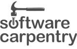

```{r, child="header.Rmd"}
```

```{r logo, echo=FALSE}
xaringanExtra::use_logo(
  image_url = "https://raw.githubusercontent.com/carpentries/logo/756b57cb8ae9a469dc92d9f8b9409193a713181d/carpentries-hex-white.svg",
  link_url = "https://carpentries.org/"
)

```


## Quem somos nós?

.pull-left[
### Mariana Dias Guilardi
<!-- inicio icones -->
<a href='mailto:diasgmariana@gmail.com'><i class="far fa-envelope"></i></a>   
<a href='https://twitter.com/mariguilardi'  target="_blank"><i class="fab fa-twitter"></i></a>   
<a href='https://github.com/mariguilardi' target="_blank"><i class="fab fa-github"></i></a>   
<a href='https://orcid.org/0000-0002-6076-0023' target="_blank"><i class="fab fa-orcid"></i></a>   
<a href='https://bit.ly/2QPS4Rr' target="_blank"><i class="ai ai-lattes"></i></a> 
<!-- final icones -->

- Em processo para se tornar instrutora da The Carpentries
- Participante: [PyLadies São Paulo](sympla.com.br/PyLadiesSP), [R-Ladies São Paulo](https://www.meetup.com/R-Ladies-Sao-Paulo/)
- Co-organizadora: [satRday São Paulo](https://saopaulo2019.satrdays.org/)
- Mestranda no Programa Interunidades em Biotecnologia (USP/IPT/IBu)
- Bacharela em Ciências Biológicas (UFSCar campus Sorocaba)
]

.pull-right[
### Beatriz Milz
<!-- inicio icones -->
<a href='https://beatrizmilz.com'><i class="fas fa-house-user"></i></a>    
<a href='mailto:beatriz.milz@usp.br'><i class="far fa-envelope"></i></a>   
<a href='https://twitter.com/BeaMilz'  target="_blank"><i class="fab fa-twitter"></i></a>   
<a href='https://github.com/beatrizmilz' target="_blank"><i class="fab fa-github"></i></a>   
<a href='https://orcid.org/0000-0002-3064-4486' target="_blank"><i class="fab fa-orcid"></i></a>   
<a href='http://lattes.cnpq.br/5150665880581477' target="_blank"><i class="ai ai-lattes"></i></a>   
<a href='https://beatrizmilz.github.io/resume/index.html' target="_blank"><i class="ai ai-cv"></i></a>   
<a href='https://discourse.curso-r.com/u/beatrizmilz/summary' target="_blank"><i class="fab fa-discourse"></i></a> 
<a href='https://www.instagram.com/beatrizmilz/' target="_blank"><i class="fab fa-instagram"></i></a> 
<!-- final icones -->

- [Instrutora da The Carpentries](https://carpentries.org/instructors/)
- [Instrutora de `tidyverse` certificada pela RStudio](https://education.rstudio.com/trainers/people/milz+beatriz/)
- Co-organizadora: [R-Ladies São Paulo](https://www.meetup.com/R-Ladies-Sao-Paulo/), [satRday São Paulo](https://saopaulo2019.satrdays.org/), [LatinR](https://latin-r.com/pt), [useR! 2021 global](https://user2021.r-project.org/)
- Doutoranda em Ciência Ambiental (IEE/USP)
- Mestre em Ciências (UNIFESP)
- Bacharela em Gestão Ambiental (EACH/USP)
- [Embaixadora de Inovação Cívica da Open Knowledge Brasil](https://embaixadoras.ok.org.br/).
]

---
class: slide , middle

## Instrutores que construíram esta apresentação:

- Alexandre Villares

- Filipe Fernandes

- Melissa Weber Mendonça

- Vinicius Salazar

---
class: inverse

## Teste.

bom slide para transição. bia: lembrar de melhorar o CSS

---
class: slide , middle

## O que é The Carpentries?

- Visão: Nossa visão é ser a comunidade inclusiva líder em ensino de dados e habilidades de programação.

- Missão: A Carpentries desenvolve capacidade global em dados essenciais e habilidades computacionais para conduzir pesquisas eficientes, abertas e reproduzíveis. Treinamos e promovemos uma comunidade ativa, inclusiva e diversificada de alunos e instrutores que promove e modela a importância do software e dos dados na pesquisa. Colaboramos no desenvolvimento de lições abertas e entregamos essas lições usando práticas de ensino baseadas em evidências. Focamos nas pessoas que conduzem e apoiam pesquisas.


Fonte: https://carpentries.org/about/

---
class: slide , middle

## O que é The Carpentries?

- [Código de conduta](https://docs.carpentries.org/topic_folders/policies/code-of-conduct.html)

1. Usar linguagem acolhedora e inclusiva.  

1. Ser uma pessoa respeitosa em relação a diferentes pontos de vista e experiências.

1. Focar no que é o melhor para a comunidade.

1. Mostrar cortesia e respeitar as outras pessoas que fazem parte da comunidade.

---
class: slide , middle

## O que é The Carpentries?

- O projeto Carpentries compreende as comunidades: [Data Carpentry](http://www.datacarpentry.org/), [Library Carpentry](https://librarycarpentry.org/), [Software Carpentry](https://software-carpentry.org/), treinadores, mantenedores, ajudantes e apoiadores que compartilham a missão de ensinar habilidades básicas de computação e ciência de dados para pesquisadores.

- O foco está em pessoas conduzindo e apoiando pesquisas. 

---
class: slide , middle

## O que é The Carpentries?

.pull-left[
<br>
```{r echo=FALSE, out.width="50%", fig.align='center'}
knitr::include_graphics("img/dc.svg")
```

]

.pull-right[
- [Data Carpentry](http://www.datacarpentry.org/): desenvolve e ministra workshops sobre as habilidades de dados fundamentais necessárias para conduzir pesquisas, cobrindo todo o ciclo de vida da pesquisa baseada em dados.

- Lições:

> * [Data Analysis and Visualization in Python for Ecologists](https://datacarpentry.org/python-ecology-lesson/)

> * [Data Analysis and Visualization with Python for Social Scientists](Data Analysis and Visualization with Python for Social Scientists *alpha*)


> * [Image Processing with Python](https://datacarpentry.org/image-processing/)

> * Material da comunidade: [Python for Atmosphere and Ocean Scientists](https://carpentrieslab.github.io/python-aos-lesson/)

]

---
class: slide , middle

## O que é The Carpentries?

.pull-left[
<br>
```{r echo=FALSE, out.width="50%", fig.align='center'}
knitr::include_graphics("img/lc.svg")
```

]

.pull-right[
- [Library Carpentry](https://librarycarpentry.org/): concentra-se na construção de habilidades de software e dados em comunidades relacionadas a bibliotecas e informações. 

- Lições:

> * [Introduction to Python](https://librarycarpentry.org/lc-python-intro/)

]

---
class: slide , middle

## O que é The Carpentries?

.pull-left[
<br>
```{r echo=FALSE, out.width="50%", fig.align='center'}

```

]

.pull-right[
- [Software Carpentry](https://software-carpentry.org/): ensina aos pesquisadores as habilidades de computação de que precisam para fazer mais em menos tempo e de forma menos dolorosa.

- Lições:

> * [Programming with Python](http://swcarpentry.github.io/python-novice-inflammation)

> * [Plotting and Programming in Python](http://swcarpentry.github.io/python-novice-gapminder)

]

---
class: slide , middle

## Como este trabalho é feito?

- Treinamento e fomento de uma comunidade **ativa**, **inclusiva** e **diversa** de pessoas alunas e instrutores. 

- Desenvolvimento de lições disponíveis de forma colaborativa.

- Aplicação das lições com práticas de ensino baseadas em evidências.

---
class: slide , middle

## Como este trabalho é feito? 


Colocar aqui currículos de treinamento?

---
class: slide , middle

## Como fazer parte da comunidade?

- Sendo uma pessoa [instrutora](https://carpentries.org/community/#instructors).

- Instrutores organizam e ensinam oficinas para disseminar a alfabetização em dados e habilidades programáticas tanto local quanto globalmente. 

- Os membros de nossa comunidade de instrutores trabalham juntos para aumentar ativamente suas habilidades técnicas e de instrução. 

- Tornar-se um instrutor é um grande passo para aprimorar suas próprias habilidades técnicas e ajuda você a se tornar uma pessoa comunicadora técnica mais eficaz.

---
class: slide , middle

## Instrutores - Mundo


```{r echo=FALSE, out.width="90%", fig.align='center'}
knitr::include_graphics("img/instrutores-mundo.png")
```

Fonte: https://carpentries.org/instructors-map/

---
class: slide , middle

## Instrutores - Brasil

```{r echo=FALSE, out.width="75%", fig.align='center'}

```

Fonte: https://carpentries.org/instructors-map/

---
class: slide , middle

## Treinamento para instrutores

1. [Pedido para treinamento](https://amy.carpentries.org/forms/request_training/)

2. Receber email com o link para agendar o treinamento.

3. Treinamento online em inglês  

> * Treinamento de dois dias. 

> * Durante período de quarentena: possibilidade de realizar treinamento quatro dias com 1h30min. 


4. Checkout Process: 

  4.1 Contribuir com um workshop, através do GitHub
 
  4.2 Participar de uma discussão online (community discussion)
  
  4.3 Live coding demo de 5 minutos.
  
- [Mais informações aqui](https://carpentries.github.io/instructor-training/)

---
